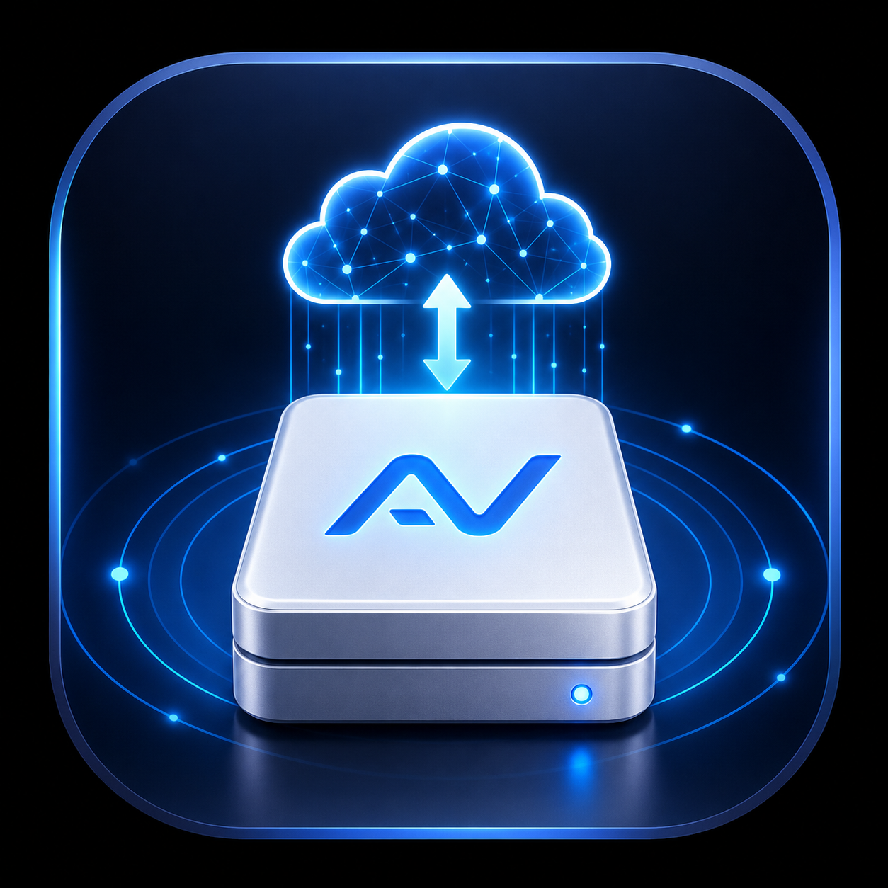

# AutoVolume 智卷

AutoVolume 是一款轻量级 macOS 菜单栏工具，用于自动检查并恢复网络文件服务器挂载。它适合 NAS、路由器外接硬盘、公司文件服务器、WebDAV 云盘等场景：网络短暂中断后，AutoVolume 会按配置重新连接，减少手动打开 Finder、重新输入服务器地址和账号密码的次数。



## 核心能力

- 支持 SMB、WebDAV、AFP、NFS。
- 支持为每个网络卷配置服务器地址、远程路径、账号、密码、挂载点和检查间隔。
- SMB 支持 SMB2 到 SMB3 自动协商，不启用 SMB1。
- SMB 支持 SMB3 Multichannel 和异步目录读取相关配置。
- 支持挂载服务器内部目录，例如 `smb://nas.local/share/tools`。
- 网络中断后自动检测服务器恢复，并重新挂载。
- 挂载成功后打开 Finder 到目标目录。
- 列表展示挂载状态、失败状态和本地告警，不使用系统弹窗打断工作。
- 密码保存在本地加密文件中，不依赖 macOS 钥匙串。
- 支持中文和英文界面。

## 下载和安装

当前测试包位于：

- DMG: `AutoVolume/dist/AutoVolume-0.1.20-local.dmg`
- ZIP: `AutoVolume/dist/AutoVolume-0.1.20-local.zip`

安装方式：

1. 打开 DMG。
2. 将 `AutoVolume.app` 拖入 `Applications`。
3. 从 `Applications` 启动 AutoVolume。
4. 在菜单栏中点击 AutoVolume 图标，添加你的网络卷配置。

> 当前包是本地 ad-hoc 签名测试包，未做 Developer ID 公证。首次运行时 macOS 可能会显示安全或网络卷宗权限提示。

## 配置示例

### SMB

- Server: `nas.local`
- Remote Path: `share/tools`
- Mount Point: `/Users/you/Volumes/Tools`
- Username: `your-user`

AutoVolume 会挂载 SMB share，并让 Finder 直接打开配置的子目录。

### WebDAV

- Server: `https://example.com:5006`
- Remote Path: `/` 或 `documents/project`
- Mount Point: `/Users/you/Volumes/WebDAV`

### NFS

- Server: `nas.local`
- Remote Path: `/exports/media`
- Mount Point: `/Users/you/Volumes/Media`

## 隐私和安全

- AutoVolume 不上传你的服务器地址、账号或密码。
- 密码使用本地加密文件保存于用户的 Application Support 目录。
- 挂载命令输出会脱敏，避免在错误提示中泄露密码。
- macOS 仍可能在首次访问网络卷宗时显示系统权限提示，这是系统隐私机制的一部分。

## 构建

项目当前使用 SwiftPM 源码结构，但本地 macOS app bundle 使用手写构建脚本打包。

```bash
cd AutoVolume
./script/build_and_run.sh --verify
```

生成 DMG：

```bash
cd AutoVolume
./script/package_dmg.sh 0.1.20
```

## 项目结构

```text
AutoVolume/
  Sources/AutoVolumeApp/      macOS 菜单栏 App
  Sources/AutoVolumeAgent/    后台检测和重连 Agent
  Sources/AutoVolumeShared/   配置、挂载、加密、状态等共享逻辑
  ManualTests/                本地手工测试入口
  Resources/                  Info.plist、图标、LaunchAgent plist
  script/                     构建和 DMG 打包脚本
docs/
  index.html                  GitHub Pages 产品介绍页
```

## 发布说明

### 0.1.20 local

- 改进 Agent 首次自动挂载后的 Finder 打开行为。
- 改进 DMG 安装窗口布局和 Applications 图标显示。
- 支持 SMB 子目录直接浏览。
- 支持本地加密密码存储。
- 支持非系统弹窗告警。

## License

尚未指定许可证。发布到公开 GitHub 仓库前建议补充 License。
